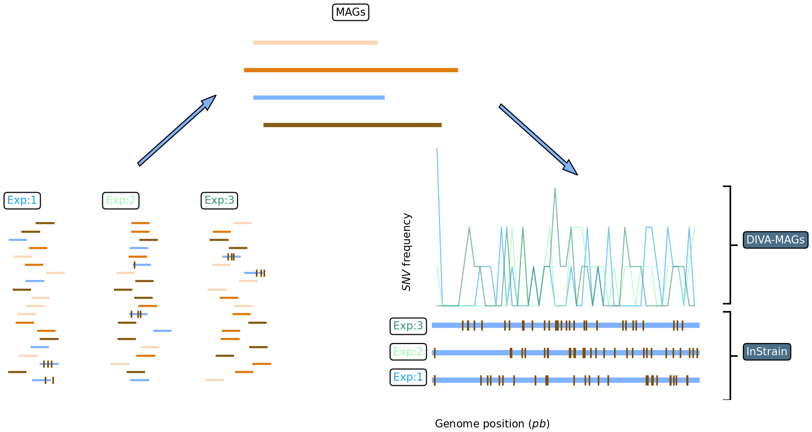

# DIVA-MAGs: a microdiversity explorer

DIVA-MAGs is a bacterial microdiversty explorer. It allows to compare SNVs call from different experiment and different MAGs (eg obtained by de-novo assembly) both vith visualization and producing tabular data containing SNVs frequencies obtained both with classical binning and sliding window strategies.



## REQUIREMENRTS
The program was written using the following libraries:

	Python 3.8.12
	Pandas: 1.3.5
	Matplotlib: 3.5.0
	Numpy: 1.22.2

## INPUT

In the same folder the user has to provide the output of an InStrain run. In particular, the output provides information about the taxonomic profilaiton process and the SNVs calling.
The user can specify the set of parameters (see below) modifying the consiguration.json file.


\*\*\*_SNVs.tsv File generated by InStrain, containing genomic coordinates and information for each variant detected. 
\*\*\*_scaffold_info.tsv File generated by InStrain, containing length and coverage metrics for each scaffold.

The typical locations for such files are supposed to be:

    --DATA_DIR--|
                |
                |--ExperimentDir--|
                                  |
                                  |--***_SNVs.tsv
                                  |-***_scaffold_info.tsv


## HOW TO RUN

Before running, please ensure that the configuration file is edited according to your preferences. 

go to folder where you downloaded the software. 

``` cd ../your/path/here/DIVA-MAG ```

once here run from terminal: 

``` python3 divamag.py ```

as long as the folder strucutre of the software is respected, the huse has not to prvide any inout to the program, which are passed trough tho config.json file. We report the user-editable features whic can be considered, for practical purposes, as flags:

* ``` DATA_DIR ```: relative/absolute path where experiments folder and InStrain output are stored.

* ``` experiments ```: name of the folders inside DATA_DIR which the user wants to invesitgate.

* ```MAGs ```: the list of MAGs (.fa) that will be analyzed by the program.

* ``` window_size ```: width of the window in which present SNVs are enumerated. The number of single variants will be reported to be in the middle point of the window. \*

* ``` step_size ```: increment afdter each enumeration of SNVs. \*\*

* ```pc_threshold ```: the minimum position coverage to report non empty window.

* ``` compare_experiments ```: if set to 1 the program will compare the MAG SNVs calling from the provided experiments.

* ``` comparison_height ```: if set not to zero this will represent the shift on the y-axis of the (g,SNV)-curve of each experiment.

\* Scaffolds shorther than one widow will be discarder. We suggest to chech by your own how large your scaffolds are.

\*\* Note that in the case window_size=step_size the user can obtain a standard binning procedure.

## OUTPUT: the aim of the program is to determine regions in MAGs richer in SNVs

The program will create in the folder of each experiment a sub-folder with the outcome of the analysis. Such folders will contain the (g,SNV) plot for the corresponding MAG and the tabular data (MAG_name.csv) with which such plot are generated. Tables are organized as follows:

* ``` genomic_coordinate ```: the position (relative to the whole MAGs, in pb) where the corresponding number opf SNVs was found. 
* ``` scaffold_coordinate ```: the position (relative to the scaffold, in pb) where the corresponding number opf SNVs was found. 
* ``` SNV_density ```: the (absolute) number of SNV found in a particular position of the MAG/scaffold.
* ``` scaffold ``` : the scaffold ID relative to the two previous columns.

if the compare_experiments flat is set to 1, the program will create a folder ./compareMAGs which will contain a plot for each investigrated MAG. Such plot overlay the (g,SNV) curve of each experiment. This is thought to be informative when user looks for hihly variable genome region. Plots are generated from the MAG_name.csv files as well.
